# GitSpeak

## Overview

GitSpeak is an AI-powered Code Quality Intelligence Agent that analyzes code repositories and generates actionable, developer-friendly reports. It goes beyond simple linting to understand code structure, detect real issues, and provide practical insights to help developers understand their codebases.

**Live Demo:** https://gitspeak-langgraph-mcp1.onrender.com

**Video:** 

## Features Implemented

### Core Features

#### Multi-Language Support
- **Languages Supported:** Python, JavaScript, TypeScript, Java, C/C++, Go, Ruby, PHP, Swift, Shell scripts, R, HTML/CSS, SQL, YAML/JSON, Markdown
- **Enhanced Python Support:** Advanced AST parsing for precise function and class extraction
- **Jupyter Notebook Support:** Cell-by-cell analysis of .ipynb files
- **Configuration Files:** Analysis of Dockerfiles, Makefiles, requirements.txt, package.json

#### Repository Analysis
- **Accepts URL:** GitHub/GitLab 
- **Private Repository Support:** GitHub token integration for private repo access and analysis about pull requests
- **Public Repository Fallback:** Git clone for public repos when no token available
- **Caching System:** Persistent storage of analyzed repositories.Used SqliteSaver for that.
- **Project Structure Analysis:** Automatic detection of project type, frameworks, and languages


#### Code Analysis using Code Analyst Agent
**Code files Analysis**
   - Ask about any code files
   - Tries to analyze files & releanship with each other
#### Security Issue Detection using Security Agent


**Security Vulnerabilities**
   - Authentication and authorization flaws
   - Input validation issues
   - Cryptographic weaknesses
   - Dependency vulnerabilities
   - Secret exposure detection


#### Perfomance Analysis using Perfomance Agent
 **Performance Bottlenecks**
   - CPU and memory inefficiencies
   - Database query optimization
   - I/O blocking operations
   - Algorithmic complexity issues
   - Caching opportunities

#### Quality Issue Detection using Quaity Agent

- For Report,Charts and Mermaid diagram  Geneartion
- For summary Generation of whole Project

#### Interactive Q&A System
- **Natural Language Processing:** Conversational interface for code queries
- **Context-Aware Responses:** Maintains conversation history and context
- **Follow-up Support:** Handles clarifications and detailed explanations
- **Multi-Domain Queries:** Can answer questions spanning security, performance, and quality

### Bonus Layer Features

#### Web Deployment
- **Live Web Application:** Deployed on Render with Chainlit UI
- **Interactive Interface:** Modern web UI with real-time streaming responses
- **Image Support:** Inline display of charts and diagrams
- **Session Management:** Persistent conversations and repository caching

#### Visualizations
- **Chart Generation:** QuickChart.io integration for metrics visualization
  - Bar charts for comparisons
  - Line charts for trends
  - Pie/Doughnut charts for distributions
  - Radar charts for multi-dimensional scores
- **Mermaid Diagrams:** Advanced diagram generation
  - Flowcharts for process visualization
  - Class diagrams for OOP relationships
  - Sequence diagrams for interaction flows
  - Mindmaps for concept hierarchies

#### GitHub Integration
- **Pull Request Analysis:** Comprehensive PR review and impact assessment
- **CI/CD Integration:** Analysis of workflow runs and check results
- **Commit History:** Examination of code changes and their implications
- **API Access:** Full GitHub API integration with rate limiting and error handling

### Super Stretch Features

#### RAG Implementation
- **Vector Store:** FAISS-based similarity search for large codebases
- **Embeddings:** OpenAI text-embedding-3-large for semantic code understanding
- **Chunk Management:** Intelligent relevance scoring of code units and retry mechanism using refine question node to get betetr code chunks.


#### AST Parsing
- **Python AST Analysis:** Deep parsing of Python code structures
- **Function/Class Extraction:** Precise identification of code units with metadata
- **Structural Insights:** Understanding of code relationships and dependencies

#### Agentic Design Patterns
- **Multi-Agent Architecture:** Four specialized agents working in coordination
  1. **Code Analyst Agent:** Architecture and design pattern analysis
  2. **Security Agent:** Vulnerability detection and threat modeling
  3. **Performance Agent:** Bottleneck identification and optimization
  4. **Quality Agent:** Maintainability assessment and visualization

- **LangGraph Workflow:** State-based agent orchestration
- **Dynamic Routing:** Intelligent agent selection based on query intent
- **Structured Outputs:** Pydantic models for consistent data handling

#### Automated Severity Scoring
- **Multi-Dimensional Scoring:** Security, Performance, Maintainability, Complexity scores (0-100)
- **Issue Categorization:** Critical, High, Medium, Low priority classification
- **Overall Quality Score:** Composite metric for codebase health

#### Developer-Friendly Visualizations
- **Executive Dashboards:** High-level metrics with professional styling
- **Interactive Charts:** Responsive visualizations with tooltips and legends in QuickChart
- **Architecture Diagrams:** Visual representation of code structure using Mermaid diagrams

## Architecture

### System Architecture Diagram

```mermaid
flowchart TD
    START([User Starts Session]) --> SETUP_CHECK{Existing Repos?}
    
    SETUP_CHECK -->|Yes| FIND_REPOS[find_existing_repositories]
    SETUP_CHECK -->|No| ASK_URL[Ask for GitHub URL]
    
    FIND_REPOS --> LOAD_CACHED[load_retriever_data and load_session_data]
    LOAD_CACHED --> SETUP_SESSION[setup_repository_session]
    
    ASK_URL --> VALIDATE_URL{Valid GitHub/GitLab URL?}
    VALIDATE_URL -->|No| ASK_URL
    VALIDATE_URL -->|Yes| BUILD_NEW[setup_new_repository]
    
    BUILD_NEW --> REPO_HASH[get_repo_hash]
    REPO_HASH --> CHECK_CACHE{Cache Exists?}
    
    CHECK_CACHE -->|Yes| LOAD_CACHED
    CHECK_CACHE -->|No| TOKEN_DECISION{GitHub Token Available?}
    
    TOKEN_DECISION -->|GITHUB_TOKEN exists| API_CLONE[clone_repo_via_api with aiohttp + zipfile]
    TOKEN_DECISION -->|No token| GIT_CLONE[git.Repo.clone_from for public repos]
    
    API_CLONE --> EXTRACT_ZIP[zipfile.ZipFile.extractall]
    GIT_CLONE --> LOCAL_PATH[Create local_path]
    EXTRACT_ZIP --> LOCAL_PATH
    
    LOCAL_PATH --> ANALYZE_STRUCTURE[generate_folder_structure and analyze_project_structure]
    ANALYZE_STRUCTURE --> EXTRACT_CODE[extract_code_units with AST parsing]
    EXTRACT_CODE --> BUILD_EMBEDDINGS[OpenAI Embeddings text-embedding-3-large]
    BUILD_EMBEDDINGS --> CREATE_FAISS[FAISS.from_texts Vector store creation]
    CREATE_FAISS --> SAVE_DATA[save_retriever_data and save_session_data]
    SAVE_DATA --> SETUP_SESSION
    
    SETUP_SESSION --> READY[Repository Ready]
    READY --> USER_QUERY([User Sends Message])
    
    USER_QUERY --> WORKFLOW_START[create_workflow StateGraph AgentState]
    
    WORKFLOW_START --> NODE_REWRITER[question_rewriter with SystemMessage + HumanMessage]
    
    NODE_REWRITER --> NODE_CLASSIFIER[question_classifier OffTopic model]
    
    NODE_CLASSIFIER --> TOPIC_ROUTER{on_topic_router}
    TOPIC_ROUTER -->|yes| NODE_RETRIEVER[retriever_node GLOBAL_RETRIEVERS]
    TOPIC_ROUTER -->|no| NODE_OFFTOPIC[off_topic cl.Message.send]
    
    NODE_RETRIEVER --> NODE_BATCH[batch_relevant_code_chunk BatchCodeGrading model]
    
    NODE_BATCH --> BATCH_ROUTER{router}
    BATCH_ROUTER -->|proceed_to_generate yes| NODE_SELECTION[agent_selection AgentSelection model]
    BATCH_ROUTER -->|proceed_to_generate no| NODE_REFINE[refine_question Rephrase query]
    BATCH_ROUTER -->|rephrase_count >= 2| NODE_CANNOT[cannot_answer cl.Message.send]
    
    NODE_REFINE --> NODE_RETRIEVER
    
    NODE_SELECTION --> NODE_PRESENT_CODE[present_teller_code_analyst PresentTellerOutput model]
    
    NODE_PRESENT_CODE --> NODE_CODE_ANALYST[code_analyst_agent PR decision logic]
    
    NODE_CODE_ANALYST --> PR_CHECK{PR Analysis Needed?}
    PR_CHECK -->|Yes + Token| PR_FETCH[get_pr_tool aiohttp GitHub API]
    PR_CHECK -->|No or No Token| PR_SKIP[Skip PR Analysis]
    
    PR_FETCH --> CODE_STREAM[code_analyst_llm.astream CODE_ANALYST_PROMPT]
    PR_SKIP --> CODE_STREAM
    
    CODE_STREAM --> CODE_ROUTER{code_analyst_router}
    CODE_ROUTER -->|goto_security_agent| NODE_PRESENT_SEC[present_teller_security cl.Message.send]
    CODE_ROUTER -->|goto_performance_agent| NODE_PRESENT_PERF[present_teller_performance cl.Message.send]
    CODE_ROUTER -->|goto_quality_agent| NODE_PRESENT_QUAL[present_teller_quality cl.Message.send]
    CODE_ROUTER -->|No more agents| WORKFLOW_END
    
    NODE_PRESENT_SEC --> NODE_SECURITY[security_agent security_llm.astream SECURITY_AGENT_PROMPT]
    
    NODE_SECURITY --> SEC_ROUTER{security_router}
    SEC_ROUTER -->|goto_performance_agent| NODE_PRESENT_PERF
    SEC_ROUTER -->|goto_quality_agent| NODE_PRESENT_QUAL
    SEC_ROUTER -->|No more agents| WORKFLOW_END
    
    NODE_PRESENT_PERF --> NODE_PERFORMANCE[performance_agent performance_llm.astream PERFORMANCE_AGENT_PROMPT]
    
    NODE_PERFORMANCE --> PERF_ROUTER{performance_router}
    PERF_ROUTER -->|goto_quality_agent| NODE_PRESENT_QUAL
    PERF_ROUTER -->|No more agents| WORKFLOW_END
    
    NODE_PRESENT_QUAL --> NODE_QUALITY[quality_agent quality_llm structured output QualityAnalysisOutput model]
    
    NODE_QUALITY --> VIZ_DECISION{Visualization Needed?}
    
    VIZ_DECISION -->|should_create_chart| CHART_TOOL[QuickChartTool.create_chart requests.get quickchart.io]
    
    VIZ_DECISION -->|should_create_diagram| MERMAID_TOOL[MermaidTool.create_diagram generate_mermaid_syntax mermaid.ink]
    
    VIZ_DECISION -->|Both needed| BOTH_TOOLS[Create Chart + Diagram]
    VIZ_DECISION -->|Neither needed| TEXT_RESPONSE[Text Response Only]
    
    CHART_TOOL --> DISPLAY_CHART[cl.Image Base64 decode Display inline]
    MERMAID_TOOL --> DISPLAY_DIAGRAM[cl.Image Base64 decode Display inline]
    BOTH_TOOLS --> DISPLAY_BOTH[Display Chart + Diagram]
    TEXT_RESPONSE --> DISPLAY_TEXT[cl.Message.send Formatted text]
    
    DISPLAY_CHART --> SAVE_SESSION[save_session_data Update conversation_history Increment analysis_count]
    DISPLAY_DIAGRAM --> SAVE_SESSION
    DISPLAY_BOTH --> SAVE_SESSION
    DISPLAY_TEXT --> SAVE_SESSION
    
    SAVE_SESSION --> WORKFLOW_END[Workflow Complete]
    
    NODE_OFFTOPIC --> WORKFLOW_END
    NODE_CANNOT --> WORKFLOW_END
    
    WORKFLOW_END --> USER_QUERY
    
    %% Styling
    classDef setup fill:#e8f5e8,stroke:#2e7d32,stroke-width:2px
    classDef clone fill:#fff3e0,stroke:#e65100,stroke-width:2px
    classDef langgraph fill:#e3f2fd,stroke:#1565c0,stroke-width:3px
    classDef agents fill:#f3e5f5,stroke:#7b1fa2,stroke-width:2px
    classDef tools fill:#fff8e1,stroke:#f57f17,stroke-width:2px
    classDef decision fill:#f1f8e9,stroke:#558b2f,stroke-width:2px
    classDef storage fill:#fce4ec,stroke:#ad1457,stroke-width:2px
    classDef terminal fill:#efebe9,stroke:#5d4037,stroke-width:2px
    
    class START,READY,USER_QUERY,WORKFLOW_END terminal
    class FIND_REPOS,LOAD_CACHED,BUILD_NEW,REPO_HASH,SAVE_SESSION,SAVE_DATA setup
    class API_CLONE,GIT_CLONE,EXTRACT_ZIP,LOCAL_PATH,ANALYZE_STRUCTURE,EXTRACT_CODE,BUILD_EMBEDDINGS,CREATE_FAISS clone
    class WORKFLOW_START,NODE_REWRITER,NODE_CLASSIFIER,NODE_RETRIEVER,NODE_BATCH,NODE_SELECTION langgraph
    class NODE_CODE_ANALYST,NODE_SECURITY,NODE_PERFORMANCE,NODE_QUALITY,NODE_PRESENT_CODE,NODE_PRESENT_SEC,NODE_PRESENT_PERF,NODE_PRESENT_QUAL agents
    class CHART_TOOL,MERMAID_TOOL,BOTH_TOOLS,PR_FETCH tools
    class SETUP_CHECK,VALIDATE_URL,CHECK_CACHE,TOKEN_DECISION,TOPIC_ROUTER,BATCH_ROUTER,CODE_ROUTER,SEC_ROUTER,PERF_ROUTER,VIZ_DECISION,PR_CHECK decision
    class LOAD_CACHED storage
```



### Technology Stack

- **Framework:** LangGraph for agentic workflows
- **LLMs:** OpenAI GPT-4o models with specialized configurations
- **Vector Database:** FAISS with OpenAI embeddings (text-embedding-3-large)
- **Web Framework:** Chainlit for interactive UI
- **Visualization:** QuickChart.io for charts, Mermaid.ink for diagrams
- **Deployment:** Render cloud platform
- **Monitoring:** LangSmith for observability and tracing
- **Storage:** SQLite for checkpoints and session persistence

## Installation & Setup

### Prerequisites
- Python 3.10
- OpenAI API key
- GitHub token (optional, for private repos)

### Environment Variables
```bash
OPENAI_API_KEY=openai_api_key
GITHUB_TOKEN=your_github_token  # Optional
LANGCHAIN_TRACING_V2=true
LANGCHAIN_API_KEY=
LANGCHAIN_PROJECT=gitspeak #any name 
LANGCHAIN_ENDPOINT=https://api.smith.langchain.com
```

### Installation
```bash
git clone https://github.com/vinu0404/mini_mini.git
cd mini_mini
python -m venv venv
.\venv\Scripts\activate
pip install -r requirements.txt
chainlit run main.py
```

### Dependencies
- `langchain-openai`: LLM integration
- `langchain-community`: Vector stores and tools
- `langgraph`: Agentic workflow orchestration
- `chainlit`: Web UI framework
- `faiss-cpu`: Vector similarity search
- `pydantic`: Data validation and structured outputs
- `gitpython`: Git repository handling
- `aiohttp`: Async HTTP client
- `nbformat`: Jupyter notebook parsing
- `langsmith`: Observability and monitoring

## Usage

### Web Interface
1. Start the application:
   ```bash
   chainlit run main.py
   ```
2. Navigate to `http://localhost:8000`
3. Paste a GitHub/GitLab repository URL
4. Ask questions about the codebase

### Example Queries
- "Show me a security analysis dashboard for this repository"
- "What are the performance bottlenecks in the authentication module?"
- "Create a flowchart showing the data flow in this application"
- "Generate a quality report with metrics visualization"
- "Analyze the latest pull request for security vulnerabilities"

## Key Engineering Decisions

### Why Web UI over CLI?
GitSpeak generates rich visualizations (charts and diagrams) that cannot be displayed in terminal environments. The Chainlit web interface provides:
- Inline image display for charts and diagrams
- Real-time streaming responses
- Better user experience for complex interactions
- Session management and conversation history

### Multi-Agent Architecture
The system employs four specialized agents for comprehensive analysis:
1. **Code Analyst:** Always executed first for structural understanding
2. **Security Agent:** Invoked for security-related queries
3. **Performance Agent:** Activated for performance concerns
4. **Quality Agent:** Generates final reports with visualizations

### Caching Strategy
- **Repository Level:** Entire repositories cached after initial analysis
- **Session Level:** Conversation history and context maintained
- **Vector Store:** Persistent FAISS indices for fast retrieval

### Error Handling & Resilience
- Graceful fallback for private repos without tokens
- Syntax error handling in AST parsing
- API rate limiting and timeout management
- Structured error reporting with actionable suggestions

## Monitoring & Observability

GitSpeak integrates **LangSmith** for comprehensive monitoring:
- **Trace Analysis:** End-to-end request tracking
- **Performance Metrics:** Response times and token usage
- **Error Monitoring:** Exception tracking and debugging
- **Usage Analytics:** Query patterns and user behavior

## Unique Features & Creativity

### Advanced Visualization Engine
- **Context-Aware Chart Selection:** Automatically chooses appropriate chart types based on query intent
- **Professional Styling:** Executive-level dashboards with proper color schemes and typography
- **Mermaid Integration:** Complex diagram generation with syntax validation and auto-correction

### Intelligent Agent Routing
- **Dynamic Selection:** Routes to relevant agents based on query analysis
- **Priority Ordering:** Executes agents in logical sequence
- **Context Sharing:** Passes memory between agents for comprehensive analysis

### GitHub Integration
- **Pull Request Intelligence:** Analyzes PR changes, CI/CD status, and review comments
- **Diff Analysis:** Understands code changes and their implications
- **Token Management:** Graceful degradation for public-only access

## Deployment

**Live Application:** https://gitspeak-langgraph-mcp1.onrender.com

## Challenges & Solutions

### Challenge: Dynamic Agent Routing Based on Query Intent
**Solution:** Implemented agent selection node using boolean state variables (`goto_security_agent`, `goto_performance_agent`, `goto_quality_agent`) in the `agent_selection` node. The system analyzes query intent and sets appropriate routing flags, allowing the LangGraph workflow to dynamically route to relevant agents based on the specific nature of each user query.

### Challenge: Mermaid Syntax Validation for URL-Based Image Generation
**Solution:** Enforced strict Mermaid syntax compliance by constraining the LLM output through Pydantic models with detailed field validation. The `MermaidDiagramData` model ensures proper syntax structure before generating URLs for mermaid.ink API calls

### Challenge: Irrelevant Code Chunk Retrieval
**Solution:** Created a dedicated `batch_relevant_code_chunk` node that employs a structured LLM evaluation to classify each retrieved code chunk as "relevant" or "not relevant" based on query intent. Only relevant chunks are passed to subsequent agents, significantly improving analysis accuracy and reducing noise in the multi-agent workflow.


### GitSpeak successfully implemented all the listed  features below:

### Core Requirements 
- Multi-language support (6+ languages)
- Quality issue detection (Security, Performance, Code Quality)
- Interactive Q&A system
- Comprehensive reporting

### Bonus Layers
- Web deployment with modern UI
- Rich visualizations (charts + diagrams)
- GitHub/GitLab integration

### Super Stretch Features
- RAG implementation with FAISS
- AST parsing for structural analysis
- Advanced agentic patterns with LangGraph
- Automated severity scoring
- Developer-friendly visualizations

### Innovation & Creativity
- Dual visualization system (charts + diagrams)
- Intelligent agent routing
- Pull request analysis capabilities
- Advanced error handling
- Comprehensive monitoring with LangSmith
